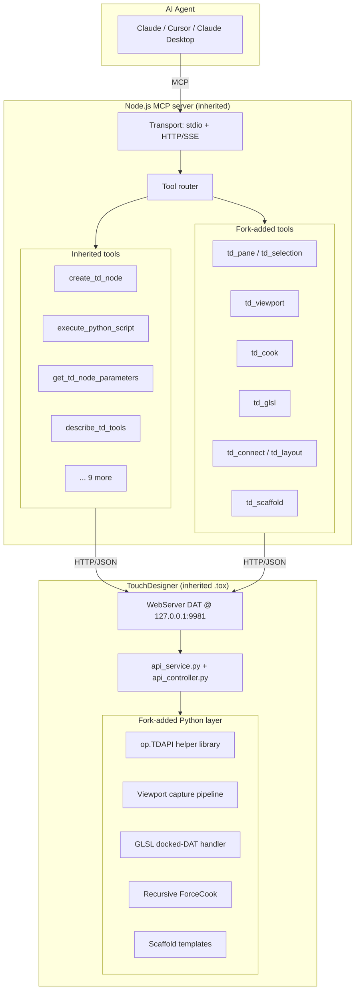
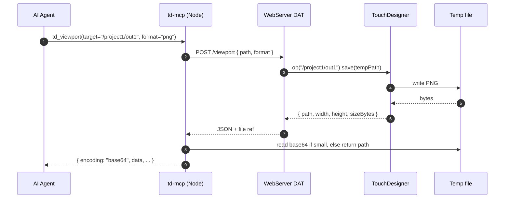
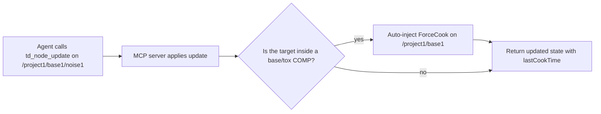
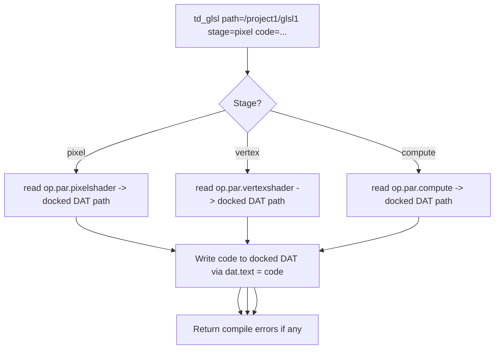

# td-mcp Fork Architecture

> Companion document to [`architecture.md`](architecture.md). That file describes the shared foundation inherited from upstream; this file describes what `td-mcp` adds on top.

**Status:** Phase 2 (design) — components documented here are *planned*, not yet implemented. Implementation tracked in [`roadmap.md`](roadmap.md) and GitHub Issues.

---

## How the fork extends the base

The upstream architecture is a clean two-process split: a Node.js MCP server on one side, a Python `WebServer DAT` inside TouchDesigner on the other, with HTTP/JSON between them. `td-mcp` keeps that split unchanged. All fork additions slot into the existing layers:



Everything inside `ExistingTools` and the `WebServer DAT + api_service/api_controller` comes from upstream and is not re-architected. Everything inside `ForkTools` and `ForkPython` is additive and lives alongside the existing modules.

---

## Viewport capture pipeline

The highest-ROI fork addition. Gives the agent a way to *see* a TOP, a COMP viewer, or the current network editor pane.



Notes:
- For a plain TOP, `op(path).save()` is the canonical capture path. No new dependencies.
- For the network editor pane, the plan is to try `ui.panes[i].savePane(filename)` first, falling back to spawning a temporary `panelCOMP` + `Panel Capture TOP`.
- Large captures (> ~256 KB) return as a file path to keep context windows sane. Small ones inline as base64.

## Cook-aware mutation flow

The upstream MCP server treats TD mutations as fire-and-forget: create the node, update the parameter, move on. That's fine when you're editing operators at the project root, but it breaks silently inside nested `baseCOMP`s where TD's cooking scheduler won't pick up the change until the parent cooks. This is a known landmine on the maintainer's own lighting control project and a recurring gotcha in the Derivative Discord.

`td-mcp` addresses it at two layers:



Behavior:
- **Mutation-path auto-cook** — `td_node_create`, `update_td_node_parameters`, and `exec_node_method` check whether the target path lives inside a base/tox COMP. If yes, the parent COMP gets a `ForceCook(recurse=True)` call before the response is returned. Controlled by server flag `--auto-cook-nested` (default: `true`).
- **Explicit `td_cook` tool** — the brute-force hammer. Recursively force-cooks an entire sub-tree and returns per-op status. Use this when the agent sees stale data despite the auto-cook behavior.
- **Stale-detection fields on reads** — `get_td_nodes` and `get_td_node_parameters` gain `lastCookTime` and `numCooks` fields (opt-in via `detailLevel: "detailed"`). The agent can decide for itself whether a value is stale.

## GLSL docked-DAT handling

TouchDesigner auto-creates `_pixel_shader` and `_vertex_shader` DATs that are *docked* to their parent GLSL TOP/MAT/POP. Tools that set `nodeX/nodeY` manually on the parent leave the docked DATs orphaned, turning "move this op" into "destroy the shader". This is a real, documented upstream bug in satoruhiga's analysis and the motivation for their `MoveOp` helper.

`td_glsl` handles it correctly:



Same principle applies to `td_node_move` and any future helper that manipulates parent positions — it delegates to `op.TDAPI.MoveOp`, which re-parents docked DATs as a unit.

## op.TDAPI Python helper library

A Python module loaded into TouchDesigner via the fork's extension to `mcp_webserver_base.tox` (or a sibling `.tox`, TBD in Phase 3), exposed as `op.TDAPI` so any `execute_python_script` call can use it without imports. Ported with attribution from [satoruhiga/claude-touchdesigner](https://github.com/satoruhiga/claude-touchdesigner/blob/main/touchdesigner/toe/src/TouchDesignerAPI.py) (MIT).

The library provides:

| Area | Functions | Why |
|---|---|---|
| Creation (docked-aware) | `CreateOp`, `CreateGeometryComp`, `ChainOperators` | GLSL TOPs auto-create docked DATs — these helpers track them |
| Movement (docked-aware) | `MoveOp` | Re-parents docked DATs on move |
| Layout | `GetBounds`, `GetAllBounds`, `CheckOverlap`, `FindEmptyArea`, `FindTypeConversionPosition` | Avoids op pile-ups; used by `td_layout` |
| Introspection | `GetParameterList`, `GetParameterHelp`, `GetOperatorInfo` | Pushes the LLM away from hallucinating parameter names |
| Error inspection | `CheckErrors` | Knows about TD's frame-boundary error cache — fix-then-check must be two separate `td_execute` calls |
| Cook control | `ForceCook` | Recursive, fixes nested baseCOMP bug |
| Debug | `PrintLayout` | ASCII dump of the network layout |

The full signature list lives in [`roadmap.md#optdapi-python-helper-library`](roadmap.md#optdapi-python-helper-library).

## Skill-layer architecture

`td-mcp` bundles a [Claude Code skill](https://docs.claude.com/en/docs/claude-code/skills) — `td-guide` — that gets loaded automatically when the agent is working on TD tasks. The skill's job is to force verification before action:

```
User: "Set the radius on sphere1 to 5"
Agent (without skill): → update_td_node_parameters({path: "sphere1", params: {radius: 5}}) → silent no-op, radius is actually radx/rady/radz
Agent (with td-guide skill): → get_td_node_parameters({path: "sphere1"}) → sees radx, rady, radz → update_td_node_parameters({params: {radx: 5, rady: 5, radz: 5}}) → correct
```

The skill structure is listed in [`roadmap.md#td-guide-skill`](roadmap.md#td-guide-skill) and gets installed alongside the MCP server via the Claude Code plugin marketplace.

---

## Principles

Every fork addition is tested against three principles:

1. **Don't re-architect upstream.** If a feature fits inside an existing handler file, add it there. If it needs a new file, keep the naming conventions upstream uses (`src/features/tools/handlers/fooTools.ts`, `td/modules/mcp/services/foo_service.py`).
2. **Return evidence, not assertions.** Every tool that mutates something must also return data an agent can use to verify the mutation succeeded — new parameter values, cook times, viewport captures, error lists.
3. **Fail loudly on known gotchas.** Frame-boundary error caches, nested baseCOMP cooking, docked DATs, IPv4/IPv6 binding, parameter name drift — the tools should detect and either auto-fix or emit structured errors the agent can act on.

---

## Open architectural questions

1. **Should `op.TDAPI` live inside the existing `mcp_webserver_base.tox` or a sibling `td_api.tox`?** Upstream keeps all TD-side code in one `.tox`. Splitting could improve reusability for non-MCP TD projects but complicates installation.
2. **Should `td_viewport` return base64 by default or a temp file path?** Base64 is simpler for agents but blows up context on large captures. Current plan: auto-switch based on size (≤ 256 KB inline, larger as path).
3. **Stream or snapshot for viewport captures?** A streaming variant would enable live monitoring loops but adds protocol complexity. Deferred to post-Phase-4.
4. **Should the auto-cook-nested behavior be opt-in or opt-out?** Current plan: opt-out (default on, flag to disable). Revisit after early testing shows whether it's surprising in practice.

These are tracked in [`roadmap.md#open-questions--deferred-decisions`](roadmap.md#open-questions--deferred-decisions).
